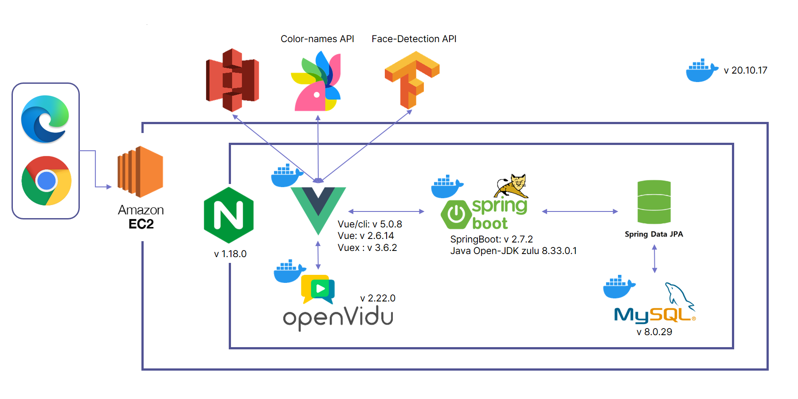

<br>

## 목차
[1. 프로젝트 개요](#1-프로젝트-개요)
- [프로젝트 목표](#프로젝트-목표)
- [전체 일정](#일정)
- [구성원](#구성원)


[2. 프로젝트 설계](#2-프로젝트-설계)
- [Figma](#figma)
- [ERD](#erd)
- [아키텍처](#아키텍처)


[3. 프로젝트 파일 구조](#3-프로젝트-파일-구조)


[4. 프로젝트 산출물](#4-프로젝트-산출물)

<br>

## 1. 프로젝트 개요
  ### 프로젝트 목표
  ### 전체 일정
  ### 구성원(SSAFY 대전캠퍼스 7th B208)
  |   Name(Git)   | [송다경](https://github.com/sa11k/) | 김민영 | [김찬일](https://github.com/chanilkim) | 이한기 | [강민성](https://github.com/pfcskms1997) | 오정환 |
  | :------: | ------ | ------ | ------ | ------ | ------ | ------ |
  | Position | Frontend | Frontend | Frontend | Frontend | Backend | Backend |

## 2. 프로젝트 설계
   ### Figma
   https://www.figma.com/file/0pfzHeX6s46qoyzQOuOdr2/%EA%B9%94%EB%A7%9E%EC%B6%A4?node-id=226%3A767
   ### ERD [(link)](README-asset/erd.png)
   ### 아키텍처
   
   ### REST API [(link)](README-asset/rest-api-docs.pdf)
     

## 3. 프로젝트 파일 구조
 >  Frontend
```
colors
├── build
├── node_modules
├── public
└── src
    ├── api
    ├── assets
    │   ├── font
    │   ├── imagedefault
    │   ├── models
    │   ├── mypage
    │   └── videos
    ├── components
    │   ├── common
    │   ├── EnterancePage
    │   ├── main
    │   ├── myPage
    │   ├── topic
    │   ├── user
    │   ├── videochat
    │   │   └── colorPallete
    │   └── Voting
    ├── router
    ├── store
    │   └── modules
    └── views
        ├── MeetingView
        └── VotingView
```


> Backend
```
└── colors
      ├── config
      ├── controller
      ├── database
      |     ├── entity
      |     └── repository
      ├── enumdata
      ├── interceptor
      ├── request
      ├── response
      ├── service
      └── util
```

## 4. 프로젝트 산출물
  - [발표자료](exec/발표자료.pptx)
  - [UCC](http://www.youtube.com)
  - [포팅 매뉴얼](exec/포팅매뉴얼.pdf)
